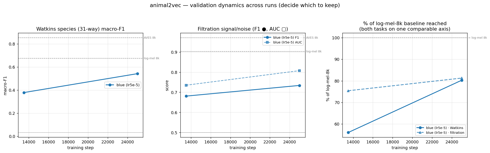

# animal2vec — validation DYNAMICS harness (decide which parallel run to keep)

Turnkey comparison of the parallel runs (blue lr5e-5 / orange lr1e-4) across training steps on **both**
probes — **Watkins species** and **signal/noise filtration** — so we can keep the better run and kill the
other. Drop checkpoints → one command → updated comparison figure + table. Results accumulate across days.

## Use (tomorrow, when Anvar sends checkpoints)
```bash
# one entry per checkpoint:  RUN:STEP:CKPT
bash run_dynamics.sh \
  "blue:30000:/home/yarix/a2v_ckpts/blue_30k.pt" \
  "orange:30000:/home/yarix/a2v_ckpts/orange_30k.pt" \
  "orange:40000:/home/yarix/a2v_ckpts/orange_40k.pt"
```
Each checkpoint runs both probes (one process at a time, RAM watchdog, 10 s input cap), registers its
`run`+`step`, then regenerates `a2v_dynamics.png`. Re-run on any new checkpoints later — it appends.
Just re-render (no GPU) after editing the registry: `~/a2v_env/bin/python a2v_dynamics.py`.

## What the figure shows
- **Panel A** — Watkins species macro-F1 vs step, one line per run; ref lines = log-mel-8k (0.675) & AVES-8k (0.853).
- **Panel B** — filtration F1 (●) and AUC (▢) vs step; ref lines = log-mel-8k (0.903) & AVES-8k (0.971).
- **Panel C** — **% of the log-mel-8k baseline reached**, both tasks on one axis. This is the
  *comparable* view (Anvar: "expecting Watkins and filtration to be comparable in quality"): it normalizes
  the 31-way and binary scores so they live on the same scale.

**Decision rule:** keep the run whose lines are **higher and rising faster** (steeper slope toward the
baselines); kill the one that plateaus or trails. Watch both tasks — keep a run only if it leads (or ties)
on both; if they disagree, that's the meeting trigger.

## Current state (seed — blue run only; orange + later steps land tomorrow)


| run | step | Watkins-F1 | filt-F1 | filt-AUC | knn-pur | NMI | %log-mel(W) | %log-mel(F) |
|---|---:|---:|---:|---:|---:|---:|---:|---:|
| blue (lr5e-5) | 13500 | 0.378 | 0.681 | 0.735 | 0.181 | 0.273 | 56% | 75% |
| blue (lr5e-5) | 25000 | 0.542 | 0.734 | 0.807 | 0.261 | 0.361 | 80% | 81% |

- **Both probes rise together** 13.5k→25k — consistent signal, the encoder is genuinely improving.
- **They converge to ~80 % of log-mel-8k at 25k** (Watkins 80 %, filtration 81 %) → at this stage the two
  tasks ARE comparable in quality, as Anvar expected. (At 13.5k filtration led, 75 % vs 56 % — the easy
  binary task saturates earlier; Watkins then caught up.)
- Steps for the seed are read from the checkpoint names (`checkpoint1`≈13.5k, `checkpoint_2_25000`=25k) —
  confirm/adjust in `dynamics_registry.json` if off.

## Files
`run_dynamics.sh` (driver) · `a2v_dynamics.py` (plotter, no GPU) · `dynamics_registry.json` (tag→run,step)
· `a2v_dynamics.png` · probe scripts `a2v_watkins.py` / `a2v_filter.py` (both now accumulate across runs).
