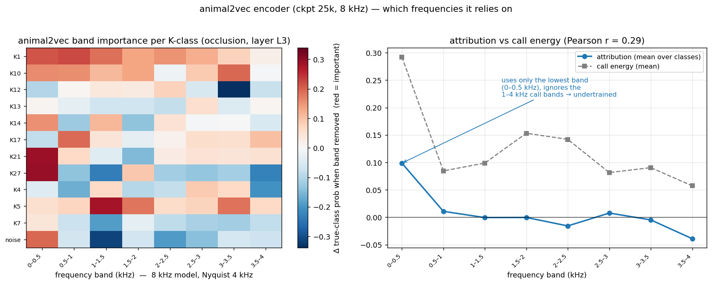
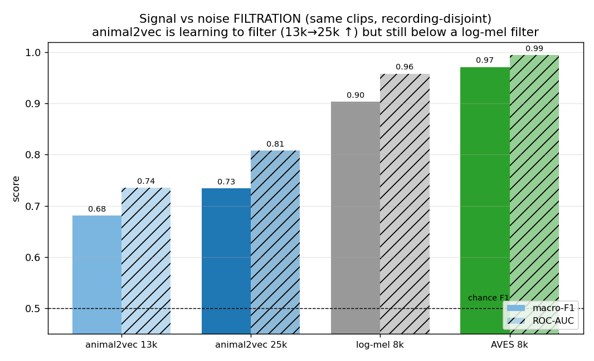

# animal2vec checkpoint validation — SUMMARY (ckpt 13.5k & 25k, blue run lr=5e-5)

**One line:** the encoder is **genuinely learning** and **improving on every probe** (species, filtration,
clustering), but at 25k (~8 % of the 320k schedule) it is **undertrained** — its frozen features are still
**below an 8 kHz log-mel baseline** on all three tasks. Keep training; evaluate the headline at 16 kHz.

This consolidates the three checks Anvar asked for: **Watkins** (clustering + class representation),
**SHAP** (which frequencies it uses), **filtration** (signal vs noise). All run on modern torch 2.9 +
RTX 5090 (lossless by weights), memory-safe.

## The picture in one table (frozen linear probe, same harness)
| task | animal2vec 13k | **animal2vec 25k** | log-mel 8k | AVES 8k | chance |
|---|---:|---:|---:|---:|---:|
| Watkins species (31-way, macro-F1) | 0.378 | **0.542** ↑ | 0.675 | 0.853 | 0.032 |
| Filtration signal/noise (macro-F1) | 0.681 | **0.734** ↑ | 0.903 | 0.971 | 0.500 |
| Filtration signal/noise (ROC-AUC) | 0.735 | **0.807** ↑ | 0.958 | 0.994 | 0.500 |

**Read:** ✅ far above chance and **rising 13k→25k on every metric** (trajectory is healthy) — but ❌ still
under a trivial 8 kHz spectrogram everywhere, so the features are **not yet useful in absolute terms**.
8 kHz is **not** the excuse: AVES-8k stays high (0.85), so the gap is **undertraining**, not bandwidth.

---

## 1. Watkins — clustering & class representation
31-way marine-mammal species, Watkins' own train/test split.
- macro-F1 **0.378 → 0.542** (+0.164 over ~11.5k updates, **rising**).
- kNN-purity **0.18 → 0.26**, KMeans-NMI **0.27 → 0.36** — clusters sharpening with training.
- Final transformer layer is the worst (typical for SSL); best is a mid layer.
- K-class (12-way orca call-types) is **flat 0.25** — a **poor proxy** at 8 kHz: orca call-type detail
  lives **> 4 kHz** (K21 has 52 % of its energy there), destroyed by the 8 kHz Nyquist. Use species, not
  call-type, to judge this encoder.

→ figures: `animal2vec_trend.png`, `animal2vec_verdict.png` · data: `animal2vec_watkins_trend.json`,
`watkins_baselines.json`

## 2. SHAP — which frequencies the encoder uses
Occlusion-SHAP on the frozen probe (best K-class layer L3): bandstop each 0.5 kHz band, re-embed, measure
the drop in true-class probability.



- Attribution **collapses onto the lowest band 0–0.5 kHz** (+0.099); flat/negative above 1 kHz; the
  3.5–4 kHz band is **−0.039** (removing it *helps* → the model treats it as noise).
- Call energy is spread over 0–2.5 kHz, but attribution sits at 0–0.5 kHz → **attr-vs-energy r = 0.29**.
- This is the **interpretability fingerprint of undertraining**: it has learned gross low-frequency energy
  cues, not the 1–4 kHz call structure a trained encoder should weight.
- Per-class: **noise** = low-band-present + mid-band-absent; **K21/K27** strongest low-band lean; **K5** the
  exception (genuine 1–2 kHz use); **K1** broad/healthy. So it *can* form mid-band features — most classes
  just haven't yet.
- **Cheap health-check going forward:** re-run on later checkpoints and watch the attribution mass migrate
  **up** into the call bands.

→ detail: `SHAP_A2V.md` · data: `a2v_shap.json`

## 3. Filtration — signal vs noise
Binary signal (any K-call) vs noise, 500+500 balanced, recording-disjoint GroupKFold, calibrated on the
same clips.



- animal2vec **13k→25k: F1 0.68→0.73, AUC 0.74→0.81** — learning a usable signal/noise boundary, rising.
- Still **below log-mel-8k** (F1 0.90 / AUC 0.96) — as a filter *right now*, a plain log-mel would do better.
- Best filtration layer is **late (L13)** vs early (L3) for call-type — coarse presence/absence lives deeper.
- **Caveat:** "noise" here is the K-project ambient class (a proxy). Re-run on Anvar's dedicated ~15 h
  sound/noise set when available — harness unchanged, just swap the manifest source.

→ detail: `FILTER_A2V.md` · data: `a2v_filter.json`, `filter_baselines.json`

---

## What to do
1. **Keep training** — healthy trajectory, but it's early (~8 %). Re-probe later checkpoints (one command
   each); the gaps to log-mel, then AVES, should close.
2. **Select checkpoints by frozen probe, not min-loss** — min-loss ≈ most-collapsed EMA teacher = worst
   features.
3. **Next encoder at 16 kHz** — we measured +10.2 pts of orca call information 8→16 kHz; 8 kHz caps the
   ceiling for call-type tasks.
4. **Headline on species / 16 kHz tasks**, where 8 kHz isn't crippling.

## Reproduce (turnkey, one checkpoint per process, memory-safe)
```bash
~/a2v_env/bin/python a2v_watkins.py  <ckpt>     # species + clustering (+ calibration: watkins_baselines.py)
~/a2v_env/bin/python a2v_shap.py     <ckpt>     # frequency-band attribution
~/a2v_env/bin/python a2v_filter.py   <ckpt>     # signal/noise (+ calibration: filter_baselines.py)
```
animal2vec needs the legacy fairseq 0.12.2 stack but runs on torch 2.9 + cu128 (sm_120 / 5090) via the
shims in `a2v_extract.py`. Slim 1.3 GB checkpoints, 10 s input cap, one model per process, RAM watchdog.

→ full verdict & calibration table: `VERDICT.md`
